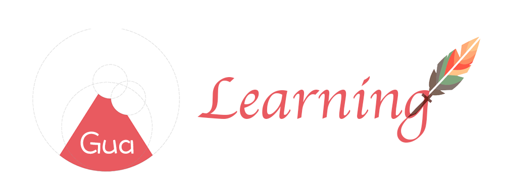
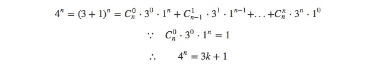

---

## 2016-07-03


### Today's leetcode

[342. Power of Four](https://leetcode.com/problems/power-of-four/)

今天Pick了一道很简单的题目，题干是**判断一个数是否为4的次方数。**我们来解决一下：



当然这只是一个充分条件，我们需要缩小一下`3k+1`的范围。即我们需先判断这个数是否为2的次方数即可，利用二级制的`x & (x - 1)`即可。

代码如下：

```cpp
class Solution {
public:
    bool isPowerOfFour(int num) {
        return num > 0 && !(num & (num - 1)) && (num - 1) % 3 == 0;
    }
};
```

- [x] 已完成 **Today's leetcode**


### Reading *iOS Core Animation: Advanced Techniques*
* Layout
  * The **frame** represents the *orter* coordinates of the layer.
  * The **bounds** property represents the *inner* coordinates
  * The **center** and **position** both represent the location of the **anchorPoint** relative to the superlayer
  * Frame is a virtual property, computed from the bounds, positon, and transform, and therefore changes when any of those properties are modified.
  * The frame width and height may no longer match the bounds.
* anchorPoint
  * The *anchorPoint* as being the handle used to move the layer around
  * The *anchorPoint* is specified in *unit coordinateds*
* Coordinate System
  * `CALayer` provides some utility methods for converting between different layers' coordinate systems:
    * `- (CGPoint)convertPoint:(CGPoint)point toView:(UIView *)view;`
    * `- (CGPoint)convertPoint:(CGPoint)point fromView:(UIView *)view;`
    * `- (CGRect)convertRect:(CGRect)rect toView:(UIView *)view;`
    * `- (CGRect)convertRect:(CGRect)rect fromView:(UIView *)view;`
  * Flipped Geometry
  * The Z Axis
    * Change the *display order* of your layers
* Hit Testing
  * `-containsPoint:`
    * Accepts a `CGPoint` in the layer's own coordinate system, and return `YES` if the point lies inside the layer's `frame`
  * `-hitTest:`
    * It returns ether the layer itself or the deepest sublayer containing the point.(BOOL)
    * The order of testing is based strivtly on the order of layers within the layer tree.
* Automatic Layout
    

- [x]Finish iOS Core Animation: Advanced Techniques


### Reading *iOS开发进阶* 

#### 『Page 85』

```Objective-C
- (BOOL)application: (UIApplication *)application didFinishLauningWithOptions: (NSDictionary *)launchOptions {
	NSObject *object = [[NSObject alloc] init];
	NSLog(@"Reference Count = %u", [object retainCount]);
	[object release];
	NSLog(@"Reference Count = %u", [object retainCount]);
	return YES;
}
```

> 为什么对象被收回后，引用计数是0而不是1？

因为当最后一次执行`release`时，系统知道马上就要回收内存了，就没有必要再将`retainCount`减1了，因为无论减不减1，改对象都肯定会被回收，而对象被回收后，它的所有内存区域包括`retainCount`值也编的没有意义。不将这个值从1变回0，**可以减少一次内存的操作，加速对象的回收**。

#### 『Page 92』

> 在ARC模式下，维护引用计数的问题会体现在什么地方？

书中明确指明，不要盲目的依赖于`ARC`机制。因为在与底层*Core Foundation*对象交互的时候，底层的*Core Foundation*对象由于不在`ARC`的管理下，所以需要自己维护这些对象的引用计数。另外，在过渡使用*block*时，也会出现关于循环引用的问题。

对于*Core Foundation*对象，只需要延续以前手工管理引用计数的办法即可。例如：

```Objective-C
// 创建一个CTFontRef对象
CTFontRef fontRef = CTFontCreateWithName((CGStringRef)@"ArialMT", fontSize, NULL);

// 引用计数+1
CFRetain(fontRef);
// 引用计数-1
CFRelease(fontRef);
```

另外在ARC下，有时候需要将一个*Core Foundation*对象转换成一个*Objective-C*对象，这个时候我们需要告诉编译器，转换过程中的引用计数需要如何调整。这就引入了与`bridge`相关的关键字，以下为说明：

* __bridge: 只做类型转换，不修改相关对象的引用计数，原来的*Core Foundation*对象在不用时，需要调用`CFRelease`方法。
* __bridge_retain-e: 类型转换后，将相关对象的引用计数+1，原来的*Core Foundation*对象不用时，需要调用`CFRelease`方法。
* __bridge_transfer: 类型转换后，将该对象的引用计数交给ARC管理，*Core Foundation*对象在不用时，不再需要调用`CFRelease`方法。


 - [x] 已完成 **Reading iOS开发进阶**
